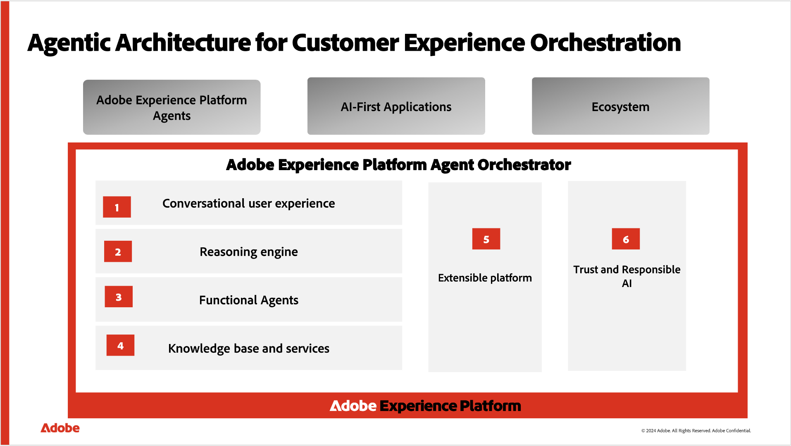

# Adobe Experience Platform Agent Orchestrator

Adobe Experience Platform Agent Orchestrator 是 Adobe Experience Platform 中新的代理式层。 Experience Platform Agent Orchestrator旨在利用Experience Platform丰富的数据和客户知识，为专门构建的Adobe Experience Platform Agent专家提供智能和推理功能，使他们能够快速大规模地执行复杂的决策和问题解决任务，而所有这些都由人为监督。 当您在 AI 助手这类对话界面中用自然语言提出问题或请求帮助时，Agent Orchestrator 会自动调用专门的代理来为您提供正确的回答。 Agent Orchestrator 会记住您的对话历史，使您能够自然地延续以前的问题，无需重复上下文，它还会结合来自多个代理的洞察，为您提供清晰、统一的回答。

您可以通过直观的对话界面完成复杂的端到端工作流程，而无需了解哪些代理正在后台工作。 系统理解您的目标，创建逐步计划，并根据您的反馈根据需要调整方法。 在AI助手中的对话中，您可以浏览Agent Orchestrator推理面板，以查看分步思考过程并更好地了解请求的处理方式。

>[!SLIDE](agent-orchestrator-overview)

请阅读本文档以了解Agent Orchestrator。

## Agent Orchestrator 的组件 {#components}

Agent Orchestrator由AI Assistant对话界面、用于决策和规划的推理引擎、Adobe Experience Platform Agent以及提供相关信息访问的知识库等几个关键组件组成。

### AI 助手对话界面 {#ai-assistant}

AI Assistant是一种智能、自然的语言对话体验，让使用已启用的Experience Cloud应用程序的从业人员能够利用GenAI和Agentic AI功能，其范围取决于客户许可的Experience Cloud应用程序。 要解锁访问权限，请阅读[访问AI Assistant的指南](https://experienceleague.adobe.com/en/docs/experience-platform/ai-assistant/access)。

有关更多信息，请阅读 [AI 助手 UI 指南](../ai-assistant/ai-assistant-ui.md)。

### 推理引擎 {#reasoning-engine}

推理引擎根据自然语言提示解释目标，检查任何限制或要求，并创建分步计划来帮助您实现目标。 与简单的问答系统不同，它可以随着情况的变化调整计划，如果需要，还可以返回并尝试不同的方法。 它创建的计划会显示在AI Assistant对话界面中，以便您能够查看和跟踪该过程，并在需要时进行干预。

### Adobe Experience Platform代理 {#agents}

Adobe Experience Platform代理是专门构建的人工智能代理分组，它们擅长跨客户体验域提供常见作业。 以下是Experience Cloud应用程序中当前可用的Adobe Experience Platform代理列表：

| 代理 | 详细信息 | 支持的应用程序 |
| --- | --- | --- |
| [Audience Agent](audience.md) | 通过Audience Agent，您可以查看关于受众的分析，包括检测受众规模的显着变化、检测重复的受众、探索受众资源以及检索受众规模。 | <ul><li>Real-Time CDP</li><li>Adobe Journey Optimizer</li></ul> |
| [Data Insights Agent](https://experienceleague.adobe.com/en/docs/analytics-platform/using/cja-overview/cja-b2c-overview/data-analysis-ai) | Data Insights Agent可从Customer Journey Analytics中的AI助手访问，是一个创新型人工智能会话代理，可快速高效地回答有关您数据的问题。 它使用来自数据视图的组件和您的实际数据在 Analysis Workspace 中构建相关的可视化图表。 | Customer Journey Analytics |
| [Experimentation Agent](./agent-experiment.md) | Experimentation Agent通过分析实验结果、预测影响和提出新实验来帮助团队更快地学习。 它集中了过去和正在进行的实验，因此您可以基于已学到的内容构建实验，找出差距，并优先考虑下一步的测试。 | Adobe Journey Optimizer Experimentation Accelerator |
| [Journey Agent](./ajo-agent.md) | Journey Agent允许Adobe Journey Optimizer用户使用自然语言界面创建、分析和优化历程。 借助Journey Agent，您可以快速构建历程，检测和解决计划或受众冲突，分析绩效和流失点，并确定表现最佳的历程以复制到未来的营销活动。 它可帮助您制定数据驱动型决策、提高客户参与度并简化历程编排。 | Adobe Journey Optimizer |
| [产品支持代理](product-support.md) | 产品支持代理是一项自助式的调试和故障排除功能，可帮助您在不离开工作流程的情况下对Adobe Experience Platform功能和应用程序进行故障排除。 支持管理员可以使用AI助手交互中的上下文创建客户支持工单，也可以通过AI助手检查工单更新。 | <ul><li>Adobe Experience Platform</li><li>Real-Time CDP</li><li>Adobe Journey Optimizer</li><li>Adobe Journey Optimizer B2B Edition</li><li>Customer Journey Analytics</li><li>Adobe Experience Manager</li></ul> |

有关Experience Cloud应用程序中代理可用性的更多信息，请查看Experience Cloud文档中的[代理AI](https://experienceleague.adobe.com/zh-hans/docs/core-services/interface/features/agentic-ai)。

### 知识库 {#knowledge-base}

知识库让代理程序能够通过结构化和非结构化数据源（包括Adobe产品文档、有关业务对象的客户元数据以及分析数据）安全地访问客户业务情报。

## 生态系统 {#ecosystem}

Agent Orchestrator生态系统包含以下代理：

| 代理 | 详细信息 |
| --- | --- |
| [Adobe Marketing Agent for Microsoft 365 Copilot](ama-ms.md) | 使用[!DNL Microsoft 365 Copilot]的Adobe Marketing Agent在[!DNL Microsoft 365]应用（如[!DNL Teams]、[!DNL Word]、[!DNL Powerpoint]和[!DNL Excel]）中检索Experience Platform的营销见解。 通过此代理，您可以： <ul><li>做出更快、数据驱动的营销决策。</li><li>减少在工具之间切换所花费的时间。</li><li>简化跨团队访问受众和历程见解的操作。</li></ul> |

## 访问 {#access}

所有用户都可以访问AI助手和关联的Experience Platform代理。

* **Adobe Experience Manager**：您的管理员必须通过[Adobe Admin Console](https://helpx.adobe.com/enterprise/using/admin-console.html)向您授予访问AI助手权限。

* **Customer Journey Analytics**：您的管理员必须通过[Customer Journey Analytics访问控制](https://experienceleague.adobe.com/en/docs/analytics-platform/using/technotes/access-control)授予您访问AI助手权限。 这允许您提问产品知识和数据见解问题。

>[!NOTE]
>
>Customer Journey Analytics没有可用的操作分析问题；因此，无其他权限适用。
