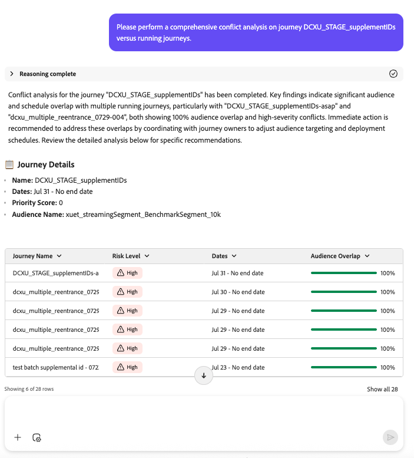

# Journey Agent：概述和用户指南

## Adobe Journey Optimizer中的Journey Agent简介

Journey Agent使Journey Optimizer用户能够使用自然语言界面创建、分析和优化营销历程。 通过 Journey 代理，从业者可以快速构建历程、发现并解决计划或受众冲突、分析性能和流失点，确定表现最佳的历程并将其复制用于未来的营销活动。 它使从业者能够做出数据驱动型决策、提高客户参与度并简化历程编排。

Journey Agent包含三个要完成的主要作业：

- **历程创建**：通过自然语言提示生成和配置营销历程
- **渠道内容创建**：使用AI支持的内容生成功能生成、编辑和管理历程的渠道特定内容（电子邮件、推送、短信）
- **历程分析**：分析历程、检测问题、揭示见解并优化客户参与

## 历程创建：用例、代理技能和用户指南

## 概述

通过历程创建，Journey Optimizer用户可以使用自然语言界面构建和配置营销历程。 借助历程创建，从业者可以通过在对话提示中描述其要求来快速创建历程。 代理可简化历程创建，允许营销人员专注于策略而不是技术配置。

>[!AVAILABILITY]
>
>历程创建适用于有权访问AI Assistant的所有客户。 但是，您需要以下权限才能完全使用历程创建功能：
>
>**管理历程**：此权限允许您直接在AI助手中创建新旅程。
>
>**查看历程事件、数据源和操作**：此权限确保AI助手可以搜索历程事件和自定义操作。
>
>**查看区段**：此权限可确保AI助手在创建历程时能够搜索受众区段。
>
>**管理区段**：此权限允许您直接在AI助手中创建新受众。

## 用例

### 历程创建的主要用例

历程创建可加快营销执行的优惠功能：

1. **事件触发的历程创建**

   - 创建根据特定客户事件激活的历程。
   - 实时设计对客户行为的自动化响应。
   - 基于客户行为构建个性化的通信流。

1. **面向受众的历程创建**

   - 构建以特定受众区段为目标的历程。
   - 设计具有策略时间的多步通信序列。

1. **业务事件触发的历程创建**

   - 创建根据特定业务事件激活的历程，并以指定受众为目标（例如，产品回售或游戏分数更改）
   - 基于客户行为构建个性化的通信流。

1. **受众资格历程创建**

   - 创建历程，并在用户档案进入或退出受众区段定义时激活。
   - 基于客户行为构建个性化的通信流。

1. **条件历程流**

   - 根据客户属性创建决策分支。
   - 根据客户喜好设计拆分路径。

对于其中每个用例，代理都会将自然语言需求转换为结构化历程配置。

## 范围和范围外的技能

### **在作用域中**

历程创建支持以下功能：

- **自然语言历程创建**：允许用户以对话语言描述历程流程。
- **基于事件和基于受众的历程**：支持基于触发器和计划的历程类型，以及业务事件和受众资格。
- **条件逻辑**：根据客户属性处理决策拆分和分支。
- **多渠道消息传递**：支持推送通知、电子邮件和短信渠道。
- **历程计划**：配置计划历程的开始日期和时间。

### **超出范围**

目前不支持以下功能：

- **高级历程分析**
- **实时历程修改**
- **跨历程编排**
- **A/B测试配置**
- **复杂的数据转换**

## 示例提示

### 创建历程的常见提示

以下是用户可以利用的有价值提示创建历程的示例。

### 事件触发的历程提示

**商店访问历程：**

“创建在用户进入我的商店位置时开始的历程。 发送推送通知以欢迎用户访问应用商店。 等待2天并检查用户是否具有有效的电子邮件地址。 如果用户拥有有效的电子邮件地址，请发送电子邮件调查来询问其商店体验。 如果用户没有有效的电子邮件地址，请发送推送通知以提示注册。”

**购买后历程：**

“创建客户在线购买时开始的历程。 发送推送通知以感谢他们购买。 接下来，检查他们是否是忠诚会员。 如果用户是忠诚度奖励会员，请发送带有10%折扣代码的第二个推送通知。 如果用户不是忠诚度奖励成员，请发送推送，邀请他们注册忠诚度计划。 请等待2天，然后发送后续推送信息，其中包含有关其购买体验的调查。”

**基于事件的促销活动：**

“创建游戏分数达到50时触发的历程。 向忠诚会员发送一条短信消息，称他们有资格从合作伙伴赞助商那里免费分到披萨。”

### 面向受众的历程提示

**季节性营销活动：**

&quot;I want to create a journey targeting an audience of day hikers. I want to send an email alerting this audience to my upcoming holiday sale that includes a variety of hiking essentials. Wait 3 days after sending the first email and send a second email that has a 15% coupon with free shipping. Wait 1 week and then send a 3rd email message to show our new sleeping bag and tent collection. Schedule the journey to start on 12/20.&quot;

**Loyalty appreciation:**

&quot;Build a loyalty appreciation journey for SUV owners, including a thank you push notification with a free carwash offer and a follow-up push notification reminder if the first notification is not interacted with within 1 day.&quot;

### Open-ended prompts

For users starting without a specific journey in mind:

- &quot;I&#39;d like to create a journey&quot;
- &quot;Help me create a journey&quot;
- &quot;Create me a journey&quot;

The agent will provide guidance and examples to help you define your journey requirements.

## 最佳实践

### Prompting best practices

To maximize the effectiveness of Journey Create, follow these best practices:

1. **Be Specific**: Provide clear details about your journey goals, target audience, and desired actions. Include information about channels, timing, and conditions.
1. **Specify Timing**: Clearly indicate wait periods between actions and when the journey should start.
1. **Define Conditions**: When using conditional logic, explain the criteria for each branch path.
1. **Include Channels**: Specify which communication channels you want to use (push, email, SMS).
1. **Mention Scheduling**: For scheduled journeys, provide the desired start date and time.
1. **Custom Actions**: If you are using custom actions in your workflow you need to specify that you are using a custom action along with the exact name of the custom action. 示例：
When a user enters my store location send a welcome message using custom action ExternalPush. Wait 2 days and then send a follow up message using custom action ExternalEmail with a survey on their visit.
1. **Validate Expressions**: Make sure to check and validate any expressions that Journey Agent creates to ensure that the correct fields and values are used.

### 设置最佳实践

- **定义明确的目标**：在创建历程之前，请建立明确的目标（提高维系率、促进转化、提高参与度）。
- **准备受众**：确保已创建目标受众并正确分段。
- **规划消息内容**：在创建历程之前定义消息传递策略。
- **考虑客户体验**：设计尊重客户偏好并避免过度沟通的历程流程。

## 渠道内容创建：用例、代理技能和用户指南

>[!AVAILABILITY]
>
>此功能仅对有限可用的所有客户可用。 请联系 Adobe 代表获取访问权限。

## 概述

渠道内容创建使Journey Optimizer用户能够使用AI支持的内容生成来生成、编辑和管理历程的特定于渠道的内容。

## 用例

### 渠道内容创建的主要用例

1. **特定于渠道的内容生成**：使用自然语言提示生成电子邮件、推送通知、SMS和其他渠道的内容。

1. **基于模板的内容创建**：通过预览功能浏览并选择可用模板。

1. **多渠道内容管理**：在同一历程工作流中为多个渠道生成和管理内容。

1. **In-context内容编辑**：在Content Designer中打开生成的内容进行编辑和细化。

1. **内容精简和迭代**：使用重新生成操作重新生成具有不同色调或样式的内容。

1. **历程画布集成**：从清单中选择历程并查看关联的渠道。

## 范围和范围外的技能

### **在作用域中**

渠道内容创建支持以下功能：

- **AI支持的内容生成**：使用自然语言提示生成电子邮件、推送、SMS和其他渠道的内容。
- **模板管理**：浏览并从具有预览功能的可用模板中进行选择。
- **In-context editing**：在Content Designer中打开生成的内容以进行编辑和细化。
- **内容重新生成**：使用“重新生成”操作重新生成具有不同色调、样式或消息传递的内容。
- **多渠道支持**：在同一历程工作流中为多个渠道生成和管理内容。
- **历程库存访问**：从库存中选择历程并查看关联的渠道。

### **超出范围**

目前不支持以下功能：

- **品牌一致性和内容质量检查**
- **将内容节点直接插入历程画布**
- **模板导入**

## 示例提示

### 内容生成

“为我的欢迎历程生成电子邮件内容。 用友好的语气为新客户创建欢迎电子邮件，并包含10%的折扣优惠。”

&quot;为我的欢迎历程的渠道电子邮件添加内容。&quot;

&quot;为我的商店访问历程生成推送通知。 创建欢迎消息，鼓励客户登记并接收特惠。”

“为事件触发的历程生成短信内容。 使用call-to-action创建一条短消息，通知客户闪购。”

### 模板选择

“向我显示季节性活动历程的可用电子邮件模板。”

“为我的电子邮件选择一个设计新颖、简洁的模板。”

### 内容编辑和细化

“在Content Designer中打开电子邮件内容，以便我可以自定义设计。”

“重新生成推送通知内容，语调更加随意。”

“更新电子邮件内容以包含促销代码。”

## 最佳实践

### 提示最佳实践

1. **明确**：提供有关内容类型、语调、目标受众和关键消息的清晰详细信息。
1. **指定渠道**：明确指示您正在为哪个渠道创建内容（电子邮件、推送、短信）。
1. **定义音调**：指定所需的音调（友好、正式、休闲、紧急）。
1. **迭代并优化**：使用重新生成操作优化内容，直到满足您的要求为止。

## 历程分析：用例、代理技能和用户指南

## 概述

Journey Agent will enable Journey Optimizer users to analyze, and optimize journeys using a natural language interface. With Journey Agent, practitioners can quickly identify and resolve schedule and/or audience conflicts, detect points of user abandonment in a journey and provide insights or recommendations. 它使从业者能够做出数据驱动的决策、提高客户参与度，并简化历程编排。

Learn more and discover the agent at a glance in this [overview](https://experienceleague.adobe.com/en/slides/journey-agent-overview).

>[!AVAILABILITY]
>
>The Journey Agent is available for all customers who have access to AI Assistant. However, you will need the following permissions in order to fully use the Journey Agent features:
>
>**View Journeys**: This permission lets you view insights into the journey directly in AI Assistant.
>
>**Manage Journeys**: To permission lets you create new journeys directly in AI Assistant.
>
>**View Segments**: This permission lets you view insights into the audiences directly in AI Assistant.
>
>**Manage Segments**: To permission lets you create new audiences directly in AI Assistant.

## 用例

### Key Use Cases for Journey Analyze

Journey Analyze offers a range of functionalities that can be leveraged to optimize marketing efforts:

1. **历程流失分析**

   - 确定客户在历程中的何处流失以及原因。
   - 识别导致客户停止参与的行为模式。
   - 利用洞察来改进历程设计，提高保留率。

1. **历程受众重叠分析**

   - 分析多个历程中的受众重叠。
   - 防止因目标选择过度而导致受众疲劳。
   - 优化分段，以确保均衡的参与度。

1. **历程计划重叠分析**

   - 识别针对同一受众群体的预定的历程之间的时间冲突。
   - 避免过度沟通，提高计划效率。
   - 确保历程在最佳时间运行，最大限度地发挥受众影响力。

1. **运营洞察**

   - Prompt-based Journey Insights – Surface operational insights about journeys , i.e. &quot;show me all live journeys.&quot;

For each of these analyses, the agent not only detects issues but also provides **actionable recommendations to resolve them**.

## 范围内和范围外的技能

### **范围内**

The following capabilities are supported by Journey Analyze:

- **回应式查询**：允许用户询问有关历程表现、受众使用情况和时间计划冲突的具体问题。
- **与其他代理集成**：与 Audience 代理和 Data Insights 代理协作进行更深入的分析。
- **Agent response structuration**: reasoning (explain the logic), analysis summary (highlight key points), issue details (describe the problem), and recommendation (propose next steps).

### **范围外**

目前不支持以下功能：

- **自动创建历程**
- **实时异常检测**
- **渠道重叠**
- **历程进入分析**
- **技术问题分析**
- **疲劳分析**

## 提示示例

### 用于历程分析的常见提示

以下是可供用户使用的很有帮助的提示示例，用于浏览、监控他们的历程以及解决相关的问题。

### 关于历程生命周期的问题

- &quot;When was [Journey Name] published?&quot;
- &quot;When was [Journey Name] stopped?&quot;
- “列出当前处于测试模式的所有历程”

### 关于历程资源的问题

- “我有多少个实时历程？”
- “向我提供所有计划定期历程及其预期运行时间的列表。”

### 受众和历程洞察

- “超过X个历程中使用了哪些受众？”
- &quot;List all journeys using the [audience name] audience.&quot;

### Fallout analysis

- &quot;I want to analyze the fallout by node for journey Fourth of July Campaign.&quot;
- “为7月4日营销活动的历程执行流失分析。”
- “在‘七月四日’营销活动的历程中，用户档案丢失情况如何？”
- “展示7月4日营销活动在旅程中用户流失的位置。”

### 冲突分析提示

使用这些提示词来分析历程之间的潜在冲突，包括时间计划和受众重叠：

- “能否对包含冲突类型（计划/历程）信息的历程[受众名称]与实时/正在运行的历程的冲突进行全面分析？”
- “请对包含冲突类型信息的历程[历程名称]进行计划冲突分析。”
- “请对包含冲突类型信息的历程[受众名称]进行历程重叠分析。”
- “历程[历程名称]是否存在任何计划冲突？”
- “向我显示历程[受众名称]的历程重叠冲突。”
- “分析历程[历程名称]与其他实时历程的所有冲突。”
- “历程[历程名称]当前有哪些冲突？”
- “检查历程[历程名称]是否与其他历程存在受众冲突。”
- “检查与历程[历程名称]有关的计划冲突。”
- “我想了解[历程名称]的所有旅程冲突。”
- “是否有任何实时历程按计划或受众与[历程名称]冲突？”
- “与正在运行的历程相比，识别历程[历程名称]的冲突类型。”
- “显示历程[历程名称]和其他历程的重叠受众。”
- “突出显示历程[历程名称]和实时历程之间的计划重叠。”
- “历程[历程名称]是否正在运行与任何其他历程冲突？”
- “请检测并列出[历程名称]的冲突。”
- “报告历程[历程名称]的所有类型的冲突。”
- “给我一个[历程名称]的冲突划分（计划和受众）。”
- “[历程名称]是否存在任何可能影响性能的冲突？”
- “是否存在影响[历程名称]的活动冲突？”
- “按计划或受众列出与[历程名称]冲突的历程。”
- “历程[历程名称]是否触发了任何冲突警报？”
- “查找历程[历程名称]的潜在受众冲突。”
- “分析历程[历程名称]的冲突风险。”
- “为[历程名称]提供冲突诊断。”

## 最佳实践

### 提示最佳实践

要最大限度地提高历程分析的有效性，请遵循以下最佳实践：

1. **描述具体**：使用清晰简洁的提示来获得有针对性的见解。 例如，请指定“列出上个月创建的所有历程”，而不是询问“我的历程是什么？”。
1. **结合洞察**：结合来自 Audience 代理和 Data Insights 代理的洞察，全面了解历程的表现。
1. **迭代改进**：使用流失和重叠分析来迭代改进历程设计和时间计划。

### 设置最佳实践

- **定义明确目标**：在分析历程之前，先确定明确的目标（例如提高保留率、增加转化率）。
- **定期监测**：计划好定期查看历程表现，以识别趋势和异常。
- **优化分段**：确保受众细分均衡，以避免疲劳以及最大限度地提高参与度。

## 幻灯片和演示

>[!NOTE]
>
>此处提供了Journey Agent的幻灯片和演示资料。 请稍后回来查看更新。
