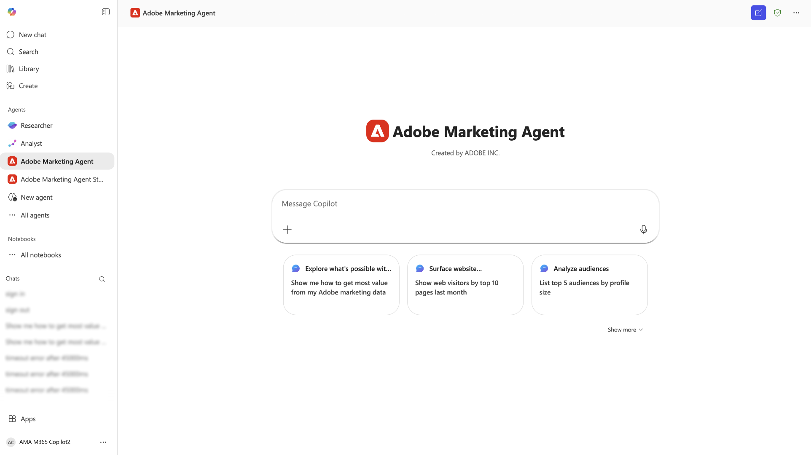

# [!DNL Microsoft 365 Copilot]的Adobe Marketing Agent

[!DNL Microsoft 365 Copilot]的Adobe Marketing Agent是AI支持的工具，它将Adobe Experience Platform直接连接到[!DNL Microsoft 365 Copilot]。 通过此代理，您可以在[!DNL Microsoft 365]应用程序（如[!DNL Teams]、[!DNL Word]、[!DNL Powerpoint]和[!DNL Excel]）中询问自然语言问题，以便立即从Experience Platform中检索营销见解，而不会中断您的工作流。 这些应用中都提供了相同的代理，并且您与Adobe Marketing Agent的聊天历史记录会转移 — 例如，您可以在[!DNL Teams]中的[!DNL Copilot]中开始研究，并在您草稿营销活动简报或审阅演示文稿时在[!DNL Word]或[!DNL Powerpoint]中继续对话。

借助适用于[!DNL Microsoft 365 Copilot]的Adobe Marketing Agent，营销经理、分析和见解团队以及业务利益相关者可以：

- 做出更快、数据驱动的营销决策。
- 减少在工具之间切换所花费的时间。
- 简化跨团队访问受众和历程见解的操作。

## 代理的工作方式

>[!IMPORTANT]
>
>适用于[!DNL Microsoft 365 Copilot]的Adobe Marketing Agent当前支持Experience Platform操作分析、Customer Journey Analytics数据分析、Audience Agent和Journey Agent。

适用于[!DNL Microsoft 365 Copilot]的Adobe Marketing Agent在Experience Platform和[!DNL Microsoft 365]应用程序之间提供了集成的体验：

- Adobe Marketing Agent在[!DNL Microsoft 365 Copilot]中显示为代理，包括在[!DNL Teams]、[!DNL Word]、[!DNL Powerpoint]和[!DNL Excel]中。
- 使用您的Adobe帐户登录，然后选择要使用的数据环境（沙盒、数据视图）。

### 数据访问和权限

您收到的回答反映了与您的Adobe身份关联的&#x200B;**数据和访问级别** — 您可以查询和查看的内容与您在Experience Platform及其相关解决方案中有权查看的内容相同。 Adobe Marketing Agent **继承**&#x200B;这些权限，并且&#x200B;**不**&#x200B;需要为[!DNL Microsoft 365]集成设置单独的权限。 对于基础Experience Platform AI助手功能和其他Adobe AI代理，**权限要求与在Experience Platform中使用这些功能相比没有变化**。

该代理将您的[!DNL Microsoft 365]实例连接到Experience Platform及其关联的应用程序（Real-Time CDP、Adobe Journey Optimizer和Customer Journey Analytics）。 利用此集成，您随后可以使用Experience Platform AI助手和代理直接检索与您的[!DNL Microsoft 365]实例相关的见解。 [!DNL Microsoft 365]实例中返回的答案以可对话的自然语言文本、表格和数据可视化形式呈现。 此外，在同一[!DNL Copilot]聊天中还提供对后续问题和调查的支持。

## 主要用例和示例情景

| 用例 | 描述 |
| --- | --- |
| 检索受众和客户历程的操作洞察 | 借助Adobe Marketing Agent，您可以轻松地检索受众和客户历程中的运营见解。 您可以确定哪些受众规模最大或参与度最高，从而可以优先考虑在何处集中努力。 您可以查看哪些客户历程当前处于活动状态并了解其执行情况，从而帮助您查明优化机会。 该代理还允许您跟踪不同区段随时间的增长或缩减情况，使您能够在发生受众动态变化时响应这些变化。 |
| 使用数据可视化更好地分析客户历程和营销活动 | 您可以查看历程绩效和流失情况，比较一段时间内的促销活动绩效，并了解哪些接触点可促进转化。 此外，您可以生成有关营销活动效果的可视化报表，并在渠道、区域或不同时间段内比较这些报表。 您还可以探索趋势，而无需手动构建查询或功能板。 |
| 增强协作和决策能力 | 使用建议的提示浏览受众、营销活动和Web流量。 利用自然语言界面，更轻松地学习Experience Platform和Customer Journey Analytics概念。 此外，您还可以在计划会议期间共享[!DNL Teams]渠道或聊天见解。 您还可以在审核计划或平台时使用Adobe Marketing Agent实时回答临时问题，从而使利益相关者能够调整同一组指标和定义。 |

## 先决条件

在为[!DNL Microsoft 365 Copilot]使用Adobe Marketing Agent之前，必须首先确保您具备以下条件：

- [!DNL Microsoft 365]与[!DNL Microsoft Teams]或[!DNL Microsoft Copilot Chat]。
- Experience Platform以及以下至少一个组件：Real-Time CDP、Adobe Journey Optimizer和/或Customer Journey Analytics。
- 对Experience Platform Agent Orchestrator和代理的权利。
- 访问您组织的Adobe Experience Cloud帐户（登录和产品权利），以获取您使用的解决方案和数据。 如果您没有Adobe访问权限，请与Adobe管理员联系。

## 为您的组织启用代理 {#enable-the-agent-for-your-organization}

只有在您的[!DNL Microsoft 365]租户中提供Adobe Marketing Agent后，最终用户才能使用该工具。**与您的[!DNL Microsoft 365] Copilot管理员**（或组织中与Copilot代理等效的管理员）合作，启用访问权限并根据您的组织要求分配代理。

管理员设置后的典型结果包括：

- 您可以在[!DNL Teams]中打开&#x200B;**[!DNL Agent Store]**，在代理列表中找到&#x200B;**[!DNL Adobe Marketing Agent]**，然后选择&#x200B;**[!DNL Add]**&#x200B;将其附加到Copilot代理。
- 或者，您的Copilot管理员也可以&#x200B;**将代理**&#x200B;发布到您组织中的每个人或特定组，以便用户无需单独添加该代理。

有关[!DNL Microsoft 365]管理中心中的管理员步骤和策略选项，请参阅Microsoft文档中的[管理Microsoft 365 Copilot的代理](https://learn.microsoft.com/en-us/microsoft-365-copilot/extensibility/manage)。

## 快速入门

在您的组织启用了代理（请参阅[为您的组织启用代理](#enable-the-agent-for-your-organization)）后，在您选择的应用程序中导航到[!DNL Microsoft 365 Copilot]，然后使用左侧导航选择&#x200B;**[!DNL All Agents]**。

找到[!DNL Adobe Marketing Agent]的信息卡或使用搜索栏手动查找代理。 拥有代理后，选择卡。

代理库中的

使用弹出窗口了解有关代理的更多信息。 准备就绪后，选择&#x200B;**[!DNL Add]**。

主页上现在更新了[!DNL Microsoft 365 Copilot]仪表板的[!DNL Adobe Marketing Agent]品牌。

### 登录并设置上下文

接下来，提示代理登录，然后执行验证帐户所需的后续步骤。 在此步骤中，您将需要复制座席返回的数字代码，然后登录到您的Adobe组织。 如果您无法完成登录，或者您缺乏对贵组织Adobe解决方案的访问权限，请联系您的&#x200B;**Adobe管理员**。

成功后，使用上下文设置器建立将用于查询的文档源、沙盒和数据视图。

### 使用代理检索操作分析

登录后，您可以使用主页中提供的提示开始操作。 您还可以利用入门提示，该提示可以扩展到分析营销受众、审查营销活动效果和监控营销活动历程。 例如，选择&#x200B;**[!DNL Review campaign performance]**，然后选择&#x200B;**[!DNL Analyze engagement - Show web visitors for top 10 products last week]**。

等待一段时间让代理进行计算，然后代理以可视化的数据表示形式做出响应。 您可以使用显示的条形图，也可以选择&#x200B;**[!DNL View data]**&#x200B;查看表中的数据。

通过选择座席建议的跟进问题，可以进一步调查。 或者，您可以引导和尝试不同的启动器提示，验证代理引用的信息源，或使用反馈机制提供反馈。

有关AI助手UI功能的详细信息，请阅读[使用AI助手](../ai-assistant/ai-assistant-ui.md)的指南。

## 安全、隐私和负责任的人工智能

**数据处理和管理**

Adobe Marketing Agent依赖的控件和治理与Experience Platform和[!DNL Microsoft 365]相同。 您的组织保留对其数据的所有权和控制权。 通过代理返回的见解涵盖每个用户的Adobe权限和数据授权；除了在Experience Platform和相关Adobe AI代理中应用的权限模型之外，不会为[!DNL Microsoft 365]表面引入其他权限模型。

**负责的AI使用**

该代理旨在返回只读见解，并且不会在Experience Platform中修改您的客户数据。 在使用生成的摘要和分析做出业务决策之前，您应该查看这些摘要和分析。

**支持的语言和范围**

初始版本以英语体验形式提供。 功能仅限于只读分析；代理不会创建或更新营销资产或配置。

## 附录

请阅读以下内容，以了解有关[!DNL Microsoft 365 Copilot]的Adobe Marketing Agent的其他信息。

### Adobe Marketing Agent [!DNL Microsoft 365 Copilot]管理步骤

要从外部提供商（第三方开发人员或Microsoft Commercial Marketplace）设置代理，您必须首先确保您的租户设置允许外部应用程序，然后通过管理中心的集成应用程序或代理部分管理这些应用程序。

#### 在租户设置中启用外部代理

在部署外部代理之前，贵组织的策略必须允许这些代理。

- 登录到[Microsoft 365管理中心](https://admin.microsoft.com/)。
- 转到&#x200B;**代理** > **设置** > **用户访问**。
- 在&#x200B;**允许的代理类型下，**&#x200B;确保已选择&#x200B;**允许由外部发布者构建的应用和代理**。

>[!IMPORTANT]
>
>如果禁用此设置，则外部代理将不会显示在用户的[代理存储](https://devblogs.microsoft.com/microsoft365dev/introducing-the-agent-store-build-publish-and-discover-agents-in-microsoft-365-copilot/)中。

#### 获取并批准代理

通常，您可以在[[!DNL Microsoft Commercial Marketplace]](https://appsource.microsoft.com/)中找到外部代理。

- 从市场&#x200B;**中**：查找所需的代理，然后选择&#x200B;**立即获取**。 这通常会使您重定向回管理中心的&#x200B;**集成应用程序**&#x200B;页面。
- **查看权限**：在[集成应用程序](https://learn.microsoft.com/en-us/microsoft-365/admin/manage/manage-deployment-of-add-ins?view=o365-worldwide)列表中，选择外部代理。
- 查看&#x200B;**Data &amp; tools**&#x200B;和&#x200B;**Security &amp; compliance**&#x200B;选项卡，查看外部提供程序将访问哪些数据。
- 选择&#x200B;**批准**&#x200B;或&#x200B;**激活**&#x200B;以将其移至您组织的清单。

#### 部署到特定用户

一旦获得批准，您就可以精确地控制哪些人在他们的Copilot侧栏中看到代理。

- 在[[!DNL Microsoft 365] 管理中心](https://admin.microsoft.com/)中，导航到&#x200B;**代理** > **所有代理**。
- 从列表中选择外部代理。
- 选择&#x200B;**部署**（或&#x200B;**编辑分配**）。
- 选择&#x200B;**特定用户/组**&#x200B;并搜索应拥有该用户的个人或[!DNL Entra ID]组。
- 选择&#x200B;**完成部署**。 这会将代理“推送”给这些用户，使其自动显示在他们的Copilot界面中。

#### 管理更新

外部提供商经常更新其代理。 要管理这些更新，请遵循以下最佳实践：

- 定期检查[[!DNL Agent Registry]](https://learn.microsoft.com/en-us/microsoft-365/admin/manage/agent-registry?view=o365-worldwide)。
- 如果更新需要新权限，代理可能会显示&#x200B;**挂起更新**&#x200B;的状态。
- 在将新版本转出到分配的用户之前，您必须手动&#x200B;**批准更新**。