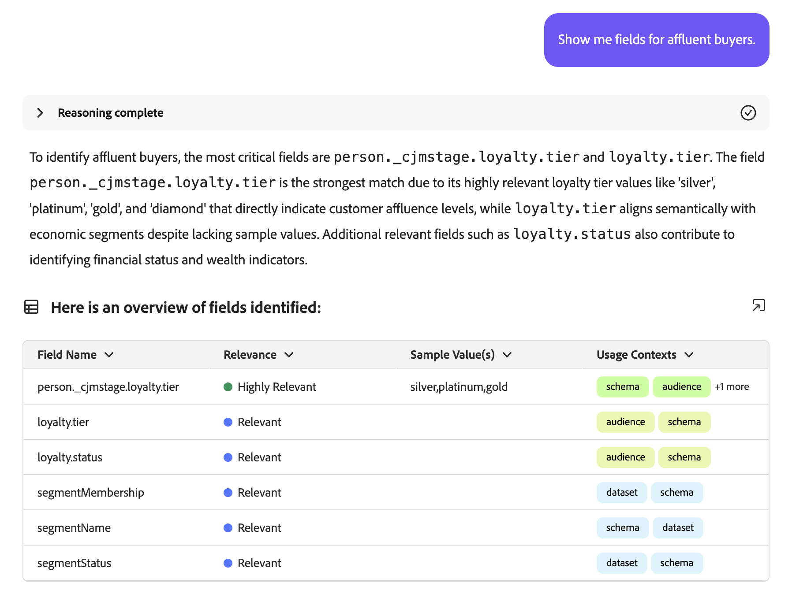
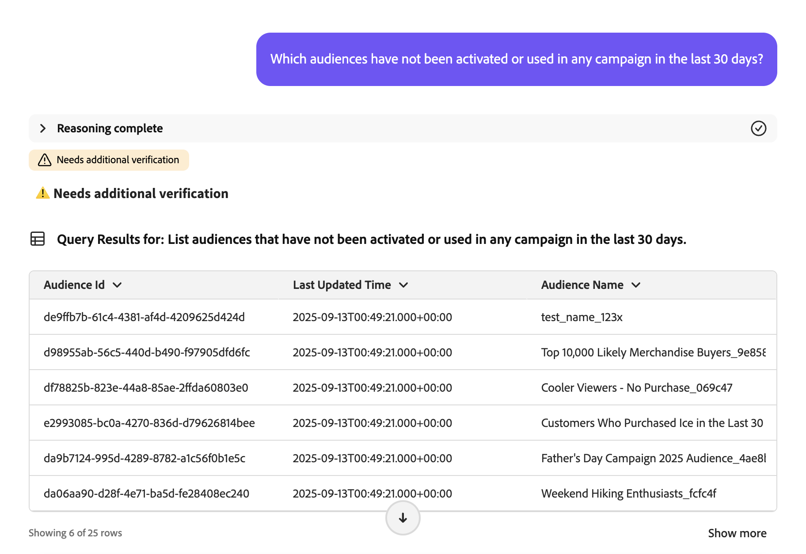
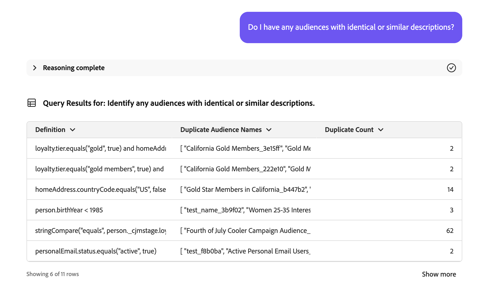
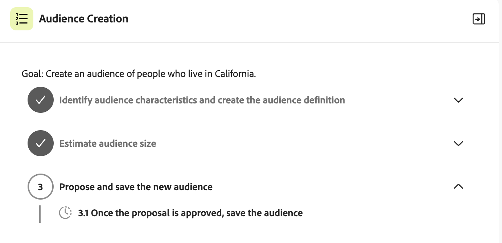

# Audience 代理

>[!AVAILABILITY]
>
>Audience Agent适用于有权访问AI Assistant的所有客户。 但是，您需要以下权限才能完全使用Audience Agent功能。
>
>**查看区段**：此权限允许您使用Audience Agent直接在AI助手中查看受众分析。
>
>**管理区段**：“收件人”权限允许您使用Audience Agent直接在AI助手中创建新受众。

通过Audience Agent，您可以查看有关受众的分析，包括检测受众规模的显着变化、检测重复的受众、探索受众资源以及检索受众规模。

>[!SLIDE](audience-agent-overview)

## 支持的用例

AI Assistant中的Audience Agent支持以下用例：

- 对话式浏览您的受众
   - 查找现有受众的受众规模
   - 查找基于完整或部分属性的受众，命名为
   - 检测重复的受众
   - 发现可用于定义受众的XDM字段
- 检测受众规模的显着变化
   - 这让您能够找到突然增加或减少的受众，从而更好地分析潜在的市场变化
- 受众创建
   - 凭借此技能，您可以根据给定的属性和事件创建受众
   - 此外，通过这项技能，可在创建受众之前估计受众的潜在大小，从而可在最有效的受众准备好激活之前快速对其进行迭代

<!--
  - Find your audience size and detect significant changes in audience size
  - This lets you find audiences that have suddenly grown or shrunk, letting you better analyze potential market changes
- Detect duplicate audiences
  - This lets you reduce redundancies with your created audiences
- Find audiences based on full or partial attributes named
  - This lets you more easily navigate through your audience inventory
- Discover XDM fields you can use to define an audience
  - This skill lets you more easily identify the right fields to use in your audience based on context and relevance 
-->

Audience Agent当前&#x200B;**不**&#x200B;支持以下功能：

- 基于目标的受众探索
   - 通过基于目标的受众探索，您可以通过应用机器学习模型（如购买或转化倾向），发现与业务目标一致的相关数据集和用户档案。

此外，在使用Audience Agent时，您应牢记以下限制：

- Audience Agent需要至少24小时来处理您的数据
   - 例如，您&#x200B;**不能**&#x200B;有一个查询在过去24小时内查找数据。 你至少需要查看最近48小时内的信息。
- Audience Agent仅支持以下受众类型：
   - 使用批处理分段评估的&#x200B;**基于人员的**&#x200B;受众
   - 针对以下用例的&#x200B;**基于帐户的**&#x200B;受众：
      - 对话受众探索
      - 重复受众检测

## 示例提示

以下示例演示了Audience Agent的示例提示和响应。

### 对话受众探索

向我展示富裕买家的栏位。

+++ 响应



+++

在过去30天内，哪些受众未激活或未用于任何营销活动？

+++ 响应



+++

列出过去3个月内映射到新目标的所有受众。

+++ 响应


+++

哪个帐户受众拥有最大的受众规模，该规模是多少？

+++ 响应


+++

### 检测重复的受众

我是否具有任何描述相同或类似的受众？

+++ 响应



+++

标识具有相同规则但名称不同的受众。

+++ 响应


+++

显示具有相同规则但不同激活目标的所有受众。

+++ 响应


+++

识别具有相同规则但名称不同的帐户受众。

+++ 响应


+++

### 检索受众规模

What is the current size of my audience &quot;Gold-star Members in California_f153e1&quot;?

+++ 响应


+++

What is my biggest audience?

+++ 响应


+++

### Detect significant changes in audience size

Which audiences have increased in size by more than 20% in the last week?

+++ 响应


+++

Which audiences have decreased in size by more than 10% in the last month?

+++ 响应


+++

What is my fastest growing audience?

+++ 响应


+++

### 创建受众

>[!AVAILABILITY]
>
>You can only use the create audience skill if you are part of the Agent Orchestrator Explorer program. For more information, contact Adobe Customer Care.

When you create an audience with Audience Agent, AI Assistant will guide you through a plan. For example, you can ask to &quot;Create an audience made up of people who live in California&quot;. AI Assistant then lists the plan that it will undertake to create the audience.

+++ 响应


+++

This plan is made up of three steps:

1. [Identify audience characteristics](#identify)
2. [Estimate audience size](#estimate)
3. [Create and persist a new audience](#create)

#### Identify audience characteristics {#identify}

{align="center" width="80%"}

接受计划后，AI Assistant将根据您的初始查询获取受众特征。

+++ 响应


对于此查询，AI Assistant会生成相关的Profile Query Language (PQL)，以查找居住在加利福尼亚的人员。 在此使用案例中，PQL查询将如下所示：

```sql
homeAddress.state.equals("California", false)
```

有关PQL的更多信息，请阅读[PQL概述](https://experienceleague.adobe.com/zh-hans/docs/experience-platform/segmentation/pql/overview)。

+++

如果AI助手的受众定义正确，则可以批准并继续下一步骤。

#### 估计受众规模 {#estimate}

{align="center" width="80%"}

在批准识别的受众特征后，AI助手将估计潜在受众的大小和受众定义详细信息。

+++ 响应


+++

如果预计的大小看起来正确，您可以批准并继续下一步骤。

#### 创建和保留新受众 {#create}

{align="center" width="80%"}

最后，如果特征和受众规模看起来是正确的，则可以批准或拒绝受众的创建。

+++ 响应

首先，您可以通过提供的数据网格查看建议的受众。


如果受众看起来是正确的，您可以通过选择&#x200B;**[!UICONTROL 创建]**&#x200B;来接受建议，以完成创建受众。


+++

现已创建受众。

{align="center" width="80%"}

## 后续步骤

阅读本指南后，您应该更好地了解Audience Agent及其支持的功能。 有关Adobe Experience Platform中代理的更多信息，请阅读[Agent Orchestrator概述](./agent-orchestrator.md)。

