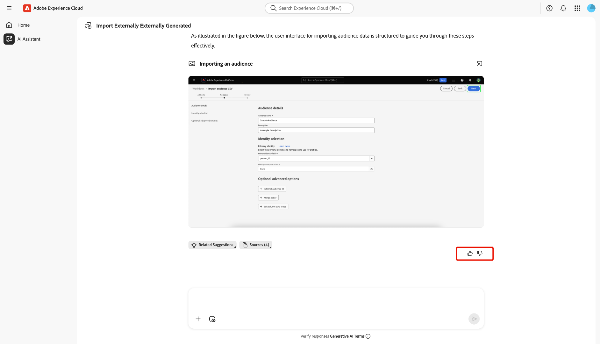
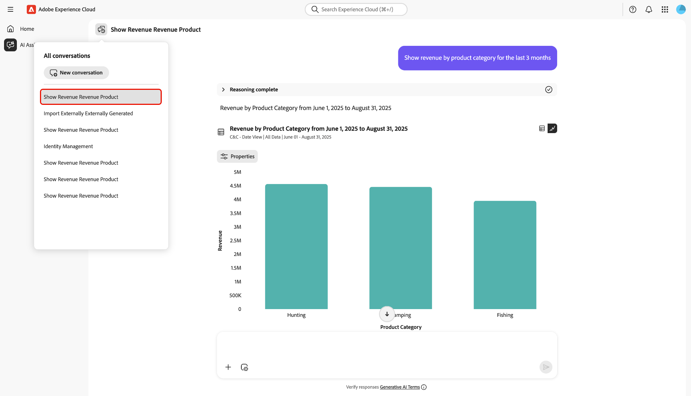
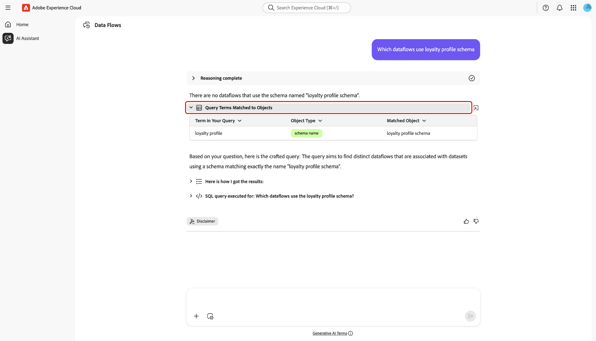
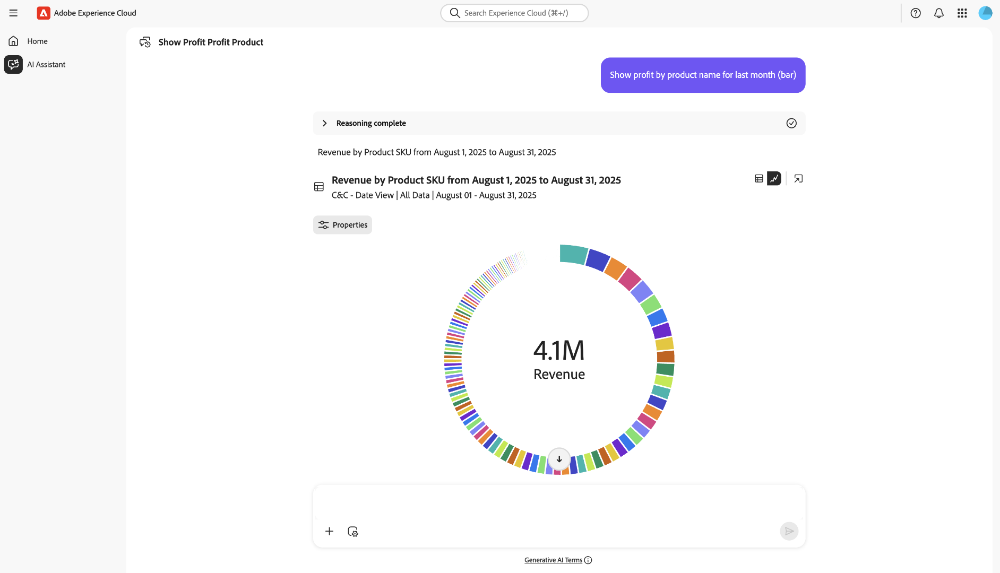

# AI 助手

>[!IMPORTANT]
>
>本文档适用于AI助手（新一代）。 有关AI助手（旧版）的信息，请参阅Adobe Experience Platform文档中的[AI助手UI指南](https://experienceleague.adobe.com/zh-hans/docs/experience-platform/ai-assistant/home)。

请参阅下表比较AI助手（旧版）和AI助手（下一代）：

| 功能区域 | AI助手（旧版） | AI助手（新一代） |
| --- | --- | --- |
| 用户体验 | AI助手（旧版）仅在右边栏面板中可用。 | AI助手（新一代）在右边栏面板和沉浸式全屏体验中均可用。 |
| 功能范围 | 您可以将AI助手（旧版）用于产品知识和操作见解。 | 您可以使用AI Assistant（新一代）来获取产品知识、运营见解以及高级代理技能和多步骤任务执行。 |
| 平台架构 | AI助手（旧版）不是在Agent Orchestrator栈栈上构建的。 | AI Assistant （下一代）由[Adobe Experience Platform Agent Orchestrator](https://experienceleague.adobe.com/zh-hans/docs/experience-cloud-ai/experience-cloud-ai/agents/agent-orchestrator)提供支持，支持可扩展性和功能间的高级协调。 |
| 应用范围 | AI Assistant（旧版）是一种特定于应用程序的实施。 | 您可以使用AI Assistant（下一代）在所有Adobe Experience Cloud应用程序中实现统一的AI Assistant体验。 |
| 访问和权限模型 | 应用程序范围的访问模型与各个产品边界保持一致。 | 所有用户均可访问AI Assistant（下一代）和相关的Experience Platform代理。 **注释**： <ul><li>**Adobe Experience Manager**：您的管理员必须授予您通过[Adobe Admin Console](https://helpx.adobe.com/enterprise/using/admin-console.html)访问AI助手（下一代）的权限。</li><li>**Customer Journey Analytics**：您的管理员必须通过[Customer Journey Analytics访问控制](https://experienceleague.adobe.com/en/docs/analytics-platform/using/technotes/access-control?lang=en)授予您访问AI助手权限。 这允许您提问产品知识和数据见解问题。 |

AI Assistant是一种智能的对话式、创新型人工智能工具，可在基于Adobe Experience Platform的应用程序中提高工作效率并重新定义工作。 您可以使用AI Assistant访问Adobe Experience Platform代理和其他AI功能。

阅读本指南，了解如何使用AI Assistant。

>[!SLIDE](agent-orchestrator-ui)

## 访问 AI 助手

可通过多种方式访问AI助手。

在Experience Cloud主页界面中，从左侧导航中选择&#x200B;**[!UICONTROL AI助手]**&#x200B;以启动AI助手的全屏视图。

+++选择以查看

+++

您还可以从Experience Cloud应用程序（如Experience Platform、Adobe Journey Optimizer和Customer Journey Analytics）的主页启动AI助手。 导航到您的产品主页，然后从顶部标题中选择&#x200B;**AI助手图标**&#x200B;以启动右边栏上的AI助手聊天面板。

+++选择以查看

+++

## 在AI助手用户界面中导航

阅读此部分以了解如何在AI Assistant界面中导航。

### 全屏视图

AI Assistant界面包括几个关键元素，可帮助您进行有效交互：

1. **[!UICONTROL 对话]**：选择&#x200B;**[!UICONTROL 对话]**&#x200B;图标以启动新对话并从历史记录中访问最近的对话。 有关详细信息，请阅读有关[对话](#conversations)的部分。
2. **输入框**：选择输入框以输入AI助手的问题和提示。 有关详细信息，请阅读有关[输入功能](#input-features)的部分。
3. **数据和对象自动完成**： — 选择加号图标以使用数据和对象建议并自动完成。 选中后，可使用弹出窗口选择建议的实体。 有关详细信息，请阅读有关[数据和对象自动完成](#autocomplete)的部分。
4. **上下文设置**： — 选择“上下文设置”图标以配置AI助手的信息源。 您可以使用此工具配置AI Assistant引用的应用程序、沙盒和数据视图，以回答您的查询。 有关详细信息，请阅读有关[上下文设置](#context-setting)的部分。
5. **发现**： — 选择&#x200B;**[!UICONTROL 学习]**、**[!UICONTROL 分析]**&#x200B;和&#x200B;**[!UICONTROL 优化]**，以查看可用于开始的示例查询。 有关详细信息，请阅读有关[可发现性提示](#discoverability-prompts)的部分。

### 边栏视图

在紧凑的面板中，边栏视图提供对聊天、发现提示、更新、对话和界面控制的快速访问。

1. **[!UICONTROL 聊天]**：从标题中选择&#x200B;**[!UICONTROL 聊天]**，以便在您离开时返回您的对话以访问界面上的不同元素。
1. **[!UICONTROL 发现]**：选择&#x200B;**[!UICONTROL 发现]**&#x200B;可查看按类别组织的AI助手提示列表。 您可以使用这些预配置的提示填充您的聊天。 此外，您可以调整建议的提示以满足特定用例。
1. **[!UICONTROL 新增功能]**：选择&#x200B;**[!UICONTROL 新增功能]**&#x200B;查看AI助手可用的最新更新列表。
1. **[!UICONTROL 对话]**：选择&#x200B;**[!UICONTROL 对话]**&#x200B;图标以启动新对话并从历史记录中访问最近的对话。 有关详细信息，请阅读有关[对话](#conversations)的部分。
1. **全屏视图**：选择&#x200B;**[!UICONTROL 全屏视图]**&#x200B;图标将AI助手界面从右边栏更改为全屏模式。
1. **数据和对象自动完成**：选择加号图标以使用数据和对象建议并自动完成。 选中后，可使用弹出窗口选择建议的实体。 有关详细信息，请阅读有关[数据和对象自动完成](#autocomplete)的部分。
1. **上下文设置**：选择“上下文设置”图标以配置AI助手的信息源。 您可以使用此工具配置AI Assistant引用的应用程序、沙盒和数据视图，以回答您的查询。 有关详细信息，请阅读有关[上下文设置](#context-setting)的部分。

## AI助手UI指南

本节概述AI Assistant用户界面中的主要功能和导航选项。 它介绍如何访问AI Assistant，描述了全屏视图和边栏视图中的布局和控制项，并介绍了对话、输入功能、自动完成、上下文设置和发现提示等关键工具。 以下部分提供了有关使用这些功能与AI Assistant交互并充分利用您的体验的详细指导。

### 发现提示 {#discovery-prompts}

您可以使用AI Assistant的发现功能来查看AI Assistant支持的常规主体（按实体分组）列表。 发现提示因您的起始点而异。

>[!BEGINTABS]

>[!TAB 从全屏视图使用发现]

从全屏视图中，发现提示分为三个类别： **[!UICONTROL 学习]**、**[!UICONTROL 分析]**&#x200B;和&#x200B;**[!UICONTROL 优化]**。

要使用发现提示来提升产品知识，请选择&#x200B;**[!UICONTROL 学习]**，然后从出现的下拉窗口中选择提示。

>[!TAB 使用边栏视图中的发现]

从边栏视图中选择&#x200B;**[!UICONTROL 发现]**&#x200B;以访问广泛的发现提示列表，您可以使用这些提示开始使用，并填充与AI助理的聊天。

>[!ENDTABS]

选择提示以填充输入框。 在此处，您可以编辑提示以适合您的特定用例。 准备就绪后，选择右侧的发送图标以提交查询。

## 与响应交互

### 推理过程检查 {#reasoning}

然后，AI Assistant查询其知识库并计算答案。 片刻之后，AI Assistant会返回答案，包括深入探究其推理过程的选项、相关建议、信息源和反馈工具。

要更好地了解基础推理过程，请选择&#x200B;**[!UICONTROL 推理完成]**。

“*[!UICONTROL 推理完成]*”窗口将展开，显示请求的摘要以及有关如何构建响应的详细信息。

### 使用相关建议

接下来，向下导航到响应的底部，并选择&#x200B;**[!UICONTROL 相关建议]**&#x200B;以接收与初始查询相关的提示列表。 您可以使用这些提示继续与AI助手对话。

### 查看源

To verify AI Assistant&#39;s response, select **[!UICONTROL Sources]** to view a list of information sources that AI Assistant referenced when calculating its response.

### 提供反馈

You can provide feedback of your experience with AI Assistant using the options provided with answer.

To provide feedback, select either thumbs up or thumbs down after receiving a response from AI Assistant, and then input your feedback in the provided text box.

>[!BEGINTABS]

>[!TAB Thumbs up]

Select **[!UICONTROL Thumbs up]** to provide positive feedback. You can optionally select from a list of positive feedback or use the input box to enter your own specific feedback.

+++选择以查看

You can also select **[!UICONTROL Detailed feedback]** to further elaborate on your feedback. When finished, select **[!UICONTROL Submit]**.

+++

>[!TAB Thumbs down]

Select **[!UICONTROL Thumbs down]** to provide constructive feedback. You can optionally select from a list of constructive feedback or use the input box to enter your own specific feedback.

+++选择以查看

Similarly, you can also select **[!UICONTROL Detailed feedback]** to further elaborate on your feedback. When finished, select **[!UICONTROL Submit]**.

+++

>[!ENDTABS]

### Use the split-view feature

If AI Assistant&#39;s response includes an image, you can select the path icon to launch a split-view mode. This allows you to read the entirety of AI Assistant&#39;s response with contextual image displayed on the right.

### 对话

You can use the *[!UICONTROL All conversations]* panel to reset and revisit conversations with AI Assistant. Select the **[!UICONTROL Conversations]** icon to view the *[!UICONTROL All conversations]* window.

To revisit a previous conversation, select the conversation topic from the list provided.

To start a new conversation, select **[!UICONTROL New conversation]**.

### Context setting {#context-setting}

Use the context setting feature of AI Assistant to configure the **application**, **sandbox**, and **dataview** that AI Assistant references to answer your query. To access context setting, select the **[!UICONTROL Context setting]** icon from the input box.

The *[!UICONTROL Answer from...]* pop-up window appears. Use this window to configure the information sources that you want to use and then select **[!UICONTROL Set context]**.

| Information source | 描述 | 示例 |
| --- | --- | --- |
| App | The Experience Cloud application that your query pertains to. | Experience Platform, Journey Optimizer, Customer Journey Analytics, etc. |
| 沙盒 | The sandbox that contains the dataset(s) or information that your query pertains to. | Prod (VA7), Dev. |
| Dataview | When you&#39;re using AI Assistant with Customer Journey Analytics, the dataview setting helps the Data Insights Agent understand: <ul><li>Which datasets to query</li><li>What data components are available</li><li>How to structure responses about your data</li><li>Which visualizations to create in Analysis Workspace</li></ul> | |

### Data and object autocomplete

You can use the autocomplete function to receive a list of data objects that exist in your sandbox. To use autocomplete, input the plus icon (+) in your query. As an alternative, you can also select the plus icon (+) located at the bottom of the text input box. A window appears with a list of recommended data objects from your sandbox.

### Verify responses

There are a number of ways that you can verify responses from AI Assistant. Select **[!UICONTROL Query Term Matched to Objects]** to view a summary of the terms in your query that were matched to specific objects in your organization.

Select **[!UICONTROL Here is how I got the results]** to see a detailed, step-by-step explanation of how AI Assistant arrived at its answer. Additionally, you can also view the SQL query that was executed to answer your question. This query is read-only and is not supported for use in Query Service.

### Configure data visualization

You can use AI Assistant&#39;s data visualization capabilities to gain a better understanding of your data. You can also specify the type of graph that you want to use in your query. For example, submit a query that says: **&quot;Show profit by product name for last month (bar)&quot;** to receive a bar graph of profit in the last month, organized by product name.

Next, select **[!UICONTROL Properties]** to change your graph type and configure values for your X and Y axis.

AI Assistant supports several graph types for data visualization. You can interact with all types of graph by hovering over the data.

>[!BEGINTABS]

>[!TAB 行]

To view a line graph, select **[!UICONTROL Properties]** and then select **[!UICONTROL Line]**.

>[!TAB Area]

要查看面积图，请选择&#x200B;**[!UICONTROL 属性]**，然后选择&#x200B;**[!UICONTROL 面积图]**。

>[!TAB 散点图]

要查看散点图，请选择&#x200B;**[!UICONTROL 属性]**，然后选择&#x200B;**[!UICONTROL 散点图]**。

>[!TAB 圆环图]

要查看圆环图，请选择&#x200B;**[!UICONTROL 属性]**，然后选择&#x200B;**[!UICONTROL 圆环图]**。

>[!ENDTABS]
