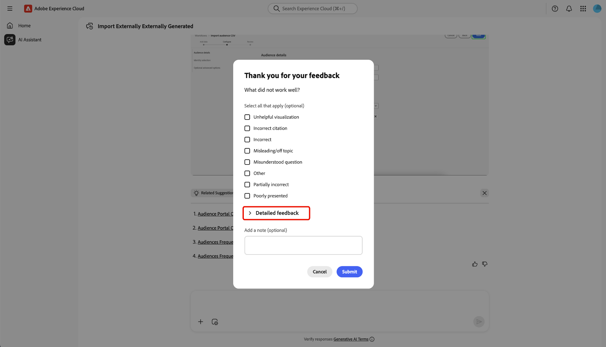
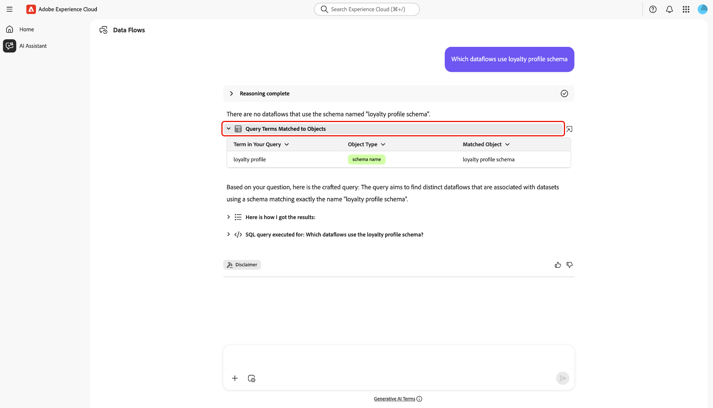

# AI助手

AI Assistant是一种智能的对话式、创新型人工智能工具，可在基于Adobe Experience Platform的应用程序中提高工作效率并重新定义工作。 您可以使用AI Assistant访问Adobe Experience Platform代理和其他AI功能。

阅读本指南，了解如何使用AI Assistant。

## 访问AI助手

可通过多种方式访问AI助手。

在Experience Cloud主页界面中，从左侧导航中选择&#x200B;**[!UICONTROL AI助手]**&#x200B;以启动AI助手的全屏视图。

+++选择以查看

+++

您还可以从Experience Cloud应用程序(如Experience Platform、Adobe Journey Optimizer和Customer Journey Analytics)的主页启动AI助手。 导航到您的产品主页，然后从顶部标题中选择&#x200B;**AI助手图标**&#x200B;以启动右边栏上的AI助手聊天面板。

+++选择以查看

+++

## 在AI助手用户界面中导航

阅读此部分以了解如何在AI Assistant界面中导航。

### 全屏视图

AI Assistant界面包括几个关键元素，可帮助您进行有效交互：

1. **[!UICONTROL 对话]**：选择&#x200B;**[!UICONTROL 对话]**&#x200B;图标以启动新对话并从历史记录中访问最近的对话。 有关详细信息，请阅读有关[对话](#conversations)的部分。
2. **输入框**：选择输入框以输入AI助手的问题和提示。 有关详细信息，请阅读有关[输入功能](#input-features)的部分。
3. **数据和对象自动完成**： — 选择加号图标以使用数据和对象建议并自动完成。 选中后，可使用弹出窗口选择建议的实体。 有关详细信息，请阅读有关[数据和对象自动完成](#autocomplete)的部分。
4. **上下文设置**： — 选择“上下文设置”图标以配置AI助手的信息源。 您可以使用此工具配置AI Assistant引用的应用程序、沙盒和数据视图，以回答您的查询。 有关详细信息，请阅读有关[上下文设置](#context-setting)的部分。
5. **发现**： — 选择&#x200B;**[!UICONTROL 学习]**、**[!UICONTROL 分析]**&#x200B;和&#x200B;**[!UICONTROL 优化]**，以查看可用于开始的示例查询。 有关详细信息，请阅读有关[可发现性提示](#discoverability-prompts)的部分。

### 边栏视图

在紧凑的面板中，边栏视图提供对聊天、发现提示、更新、对话和界面控制的快速访问。

1. **[!UICONTROL 聊天]**：从标题中选择&#x200B;**[!UICONTROL 聊天]**，以便在您离开时返回您的对话以访问界面上的不同元素。
1. **[!UICONTROL 发现]**：选择&#x200B;**[!UICONTROL 发现]**&#x200B;可查看按类别组织的AI助手提示列表。 您可以使用这些预配置的提示填充您的聊天。 此外，您可以调整建议的提示以满足特定用例。
1. **[!UICONTROL 新增功能]**：选择&#x200B;**[!UICONTROL 新增功能]**&#x200B;查看AI助手可用的最新更新列表。
1. **[!UICONTROL 对话]**：选择&#x200B;**[!UICONTROL 对话]**&#x200B;图标以启动新对话并从历史记录中访问最近的对话。 有关详细信息，请阅读有关[对话](#conversations)的部分。
1. **全屏视图**：选择&#x200B;**[!UICONTROL 全屏视图]**&#x200B;图标将AI助手界面从右边栏更改为全屏模式。
1. **数据和对象自动完成**：选择加号图标以使用数据和对象建议并自动完成。 选中后，可使用弹出窗口选择建议的实体。 有关详细信息，请阅读有关[数据和对象自动完成](#autocomplete)的部分。
1. **上下文设置**：选择“上下文设置”图标以配置AI助手的信息源。 您可以使用此工具配置AI Assistant引用的应用程序、沙盒和数据视图，以回答您的查询。 有关详细信息，请阅读有关[上下文设置](#context-setting)的部分。

## AI助手UI指南

本节概述AI Assistant用户界面中的主要功能和导航选项。 它介绍如何访问AI Assistant，描述了全屏视图和边栏视图中的布局和控制项，并介绍了对话、输入功能、自动完成、上下文设置和发现提示等关键工具。 以下部分提供了有关使用这些功能与AI Assistant交互并充分利用您的体验的详细指导。

### 发现提示

您可以使用AI Assistant的发现功能来查看AI Assistant支持的常规主体（按实体分组）列表。 发现提示因您的起始点而异。

>[!BEGINTABS]

>[!TAB 从全屏视图使用发现]

从全屏视图中，发现提示分为三个类别： **[!UICONTROL 学习]**、**[!UICONTROL 分析]**&#x200B;和&#x200B;**[!UICONTROL 优化]**。

要使用发现提示来提升产品知识，请选择&#x200B;**[!UICONTROL 学习]**，然后从出现的下拉窗口中选择提示。

>[!TAB 使用边栏视图中的发现]

从边栏视图中选择&#x200B;**[!UICONTROL 发现]**&#x200B;以访问广泛的发现提示列表，您可以使用这些提示开始使用，并填充与AI助理的聊天。

>[!ENDTABS]

选择提示以填充输入框。 在此处，您可以编辑提示以适合您的特定用例。 准备就绪后，选择右侧的发送图标以提交查询。

## 与响应交互

### 推理过程检查 {#reasoning}

然后，AI Assistant查询其知识库并计算答案。 片刻之后，AI Assistant会返回答案，包括深入探究其推理过程的选项、相关建议、信息源和反馈工具。

要更好地了解基础推理过程，请选择&#x200B;**[!UICONTROL 推理完成]**。

“*[!UICONTROL 推理完成]*”窗口将展开，显示请求的摘要以及有关如何构建响应的详细信息。

### 使用相关建议

接下来，向下导航到响应的底部，并选择&#x200B;**[!UICONTROL 相关建议]**&#x200B;以接收与初始查询相关的提示列表。 您可以使用这些提示继续与AI助手对话。

### 查看源

要验证AI助手响应，请选择&#x200B;**[!UICONTROL 源]**&#x200B;以查看AI助手在计算其响应时引用的信息源列表。

### 提供反馈

您可以使用应答中提供的选项针对AI助手体验提供反馈。

要提供反馈，请在收到AI Assistant的响应后选择竖起或竖下大拇指，然后在提供的文本框中输入反馈。

>[!BEGINTABS]

>[!TAB 竖起缩略图]

选择&#x200B;**[!UICONTROL 向上缩略图]**&#x200B;以提供正反馈。 您可以选择从正反馈列表中进行选择，或者使用输入框输入您自己的特定反馈。

+++选择以查看

您还可以选择&#x200B;**[!UICONTROL 详细反馈]**&#x200B;以进一步详细说明您的反馈。 完成后，选择&#x200B;**[!UICONTROL 提交]**。

+++

>[!TAB 拇指朝下]

选择&#x200B;**[!UICONTROL 向下]**&#x200B;的缩略图以提供建设性的反馈。 您可以选择从建设性反馈列表中进行选择，或者使用输入框输入您自己的特定反馈。

+++选择以查看

同样，您还可以选择&#x200B;**[!UICONTROL 详细反馈]**&#x200B;以进一步详细说明您的反馈。 完成后，选择&#x200B;**[!UICONTROL 提交]**。

+++

>[!ENDTABS]

### 使用拆分视图功能

如果AI Assistant的响应包含图像，您可以选择路径图标以启动拆分视图模式。 这允许您阅读右侧显示的上下文图像的AI助手响应的全文。

### 对话

您可以使用&#x200B;*[!UICONTROL 所有对话]*&#x200B;面板重置并重新访问与AI助理的对话。 选择&#x200B;**[!UICONTROL 对话]**&#x200B;图标以查看&#x200B;*[!UICONTROL 所有对话]*&#x200B;窗口。

要重新访问上一个对话，请从提供的列表中选择对话主题。

若要开始新对话，请选择&#x200B;**[!UICONTROL 新建对话]**。

### 上下文设置 {#context-setting}

使用AI助理的上下文设置功能配置AI助理引用的&#x200B;**应用程序**、**沙盒**&#x200B;和&#x200B;**数据视图**&#x200B;以回答您的查询。 要访问上下文设置，请从输入框中选择&#x200B;**[!UICONTROL 上下文设置]**&#x200B;图标。

出现&#x200B;*[!UICONTROL 应答自……]*&#x200B;弹出窗口。 使用此窗口配置要使用的信息源，然后选择&#x200B;**[!UICONTROL 设置上下文]**。

| 信息源 | 描述 | 示例 |
| --- | --- | --- |
| 应用程序 | 您的查询所属的Experience Cloud应用程序。 | Experience Platform、Journey Optimizer、Customer Journey Analytics等 |
| 沙盒 | 包含您的查询相关的数据集或信息的沙盒。 | 生产(VA7)、开发 |
| 数据视图 | 在将AI助手与Customer Journey Analytics结合使用时，数据视图设置可帮助Data Insights Agent了解： <ul><li>要查询的数据集</li><li>哪些数据组件可用</li><li>如何构建有关数据的响应</li><li>要在Analysis Workspace中创建哪些可视化图表</li></ul> |

### 数据和对象自动完成

您可以使用自动完成函数接收沙盒中存在的数据对象列表。 要使用自动完成，请在查询中输入加号图标(+)。 或者，您也可以选择位于文本输入框底部的加号图标(+)。 此时将显示一个窗口，其中包含来自沙盒的推荐数据对象列表。

### 验证响应

可通过多种方式验证来自AI Assistant的响应。 选择&#x200B;**[!UICONTROL 与对象匹配的查询词]**&#x200B;以查看查询中与组织中特定对象匹配的词的摘要。

选择&#x200B;**[!UICONTROL 以下是我获得结果的方式]**，查看有关AI助手如何获得答案的详细逐步说明。 此外，您还可以查看为回答问题而执行的SQL查询。 此查询是只读的，不支持在查询服务中使用。

### 配置数据可视化

您可以使用AI Assistant的数据可视化功能来更好地了解数据。 您还可以指定要在查询中使用的图形类型。 例如，提交一个显示：**“按产品名称显示上月利润（条形图）”**&#x200B;的查询以接收按产品名称组织的上月利润条形图。

接下来，选择&#x200B;**[!UICONTROL 属性]**&#x200B;以更改图形类型并配置X轴和Y轴的值。

AI Assistant支持多种图形类型用于数据可视化。 您可以将鼠标悬停在数据上，与所有类型的图形进行交互。

>[!BEGINTABS]

>[!TAB 行]

要查看折线图，请选择&#x200B;**[!UICONTROL 属性]**，然后选择&#x200B;**[!UICONTROL 折线图]**。

>[!TAB 区域]

要查看面积图，请选择&#x200B;**[!UICONTROL 属性]**，然后选择&#x200B;**[!UICONTROL 面积图]**。

>[!TAB 散点图]

要查看散点图，请选择&#x200B;**[!UICONTROL 属性]**，然后选择&#x200B;**[!UICONTROL 散点图]**。

>[!TAB 圆环图]

要查看圆环图，请选择&#x200B;**[!UICONTROL 属性]**，然后选择&#x200B;**[!UICONTROL 圆环图]**。

>[!ENDTABS]