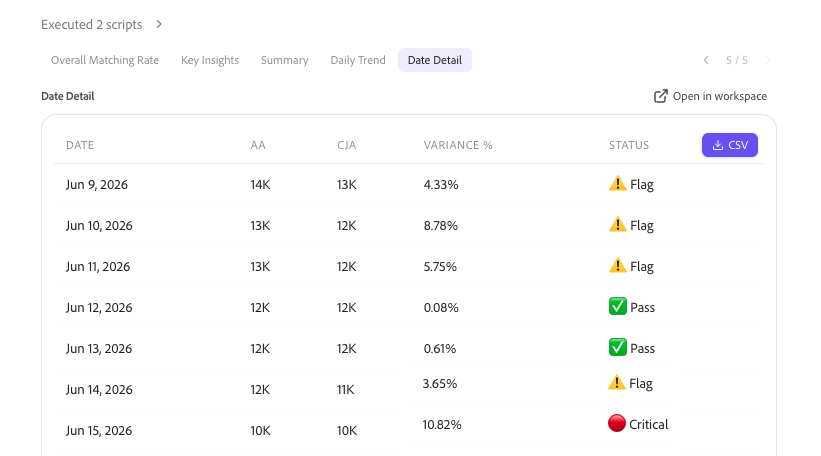

# 从Adobe Analytics升级到Customer Journey Analytics时与同事验证数据

CX Enterprise Co-worker包括验证技能，允许您在从Adobe Analytics升级到Customer Journey Analytics时验证数据。 数据验证在单个会话中完成。

此技能会自动比较：

* 每个维度、量度和趋势会分别在不同的实施中进行。

* 所有Adobe Analytics报表包针对所有Customer Journey Analytics数据视图。

进行这些比较后，该技能会生成人工智能驱动的洞察和建议，您可以实施这些洞察和建议来帮助您升级到Customer Journey Analytics。

## 开始之前

要在升级过程中验证数据，您需要：

* 要验证的Adobe Analytics报表包。

* 包含相同数据的Customer Journey Analytics数据视图。

您无需提前知道如何构建实施。 该技能会自动检测数据是通过Analytics Source Connector映射，还是通过两个并排实施映射，因此您无需自己提供该上下文。

## 启动验证会话

1. 登录到CX Enterprise Co-worker。

1. 选择&#x200B;[!UICONTROL **新建聊天**]。

1. 在文本字段中，提示代理验证从Adobe Analytics到Customer Journey Analytics的迁移：

   **提示**

   > 帮助我验证我的公司是否已从Adobe Analytics升级到Customer Journey Analytics。

   您的请求将被路由到数据验证技能，该技能将启动交互式设置过程。

1. 设置过程包括下表中的问题。 对于每个问题，请选择答案，然后选择&#x200B;[!UICONTROL **提交**]。

   >[!NOTE]
   >
   >您可以稍后在同一对话中更改其中的任何选择。 例如，要求代理更改您的报表包或数据视图，代理将仅重复更新该选择所需的步骤，而不重新启动整个设置过程。

   | 问题 | 其他上下文 |
   |---------|----------|
   | [!UICONTROL **选择您的Analytics公司**] | 这是您的Adobe Analytics登录公司。 |
   | [!UICONTROL **选择您的报表包**]<!--In the UI, recommend change to "Select your Adobe Analytics report suite"--> | 这是Adobe Analytics中的报表包，其中包含要针对Customer Journey Analytics数据验证的数据。 |
   | [!UICONTROL **选择您的Customer Journey Analytics数据视图**] | 这是Customer Journey Analytics中的数据视图，其中包含与您选择的Adobe Analytics报表包相同的数据。 |

1. 查看设置摘要，确认您正在验证正确的数据，然后再继续。 摘要包括您选择的公司、报表包和数据视图，以及每个系统中排名最前的量度和维度的预览。

1. 继续下面的部分，[选择要验证的数据](#choose-the-data-to-validate)。

## 选择要验证的数据

您可以验证单个量度或维度，也可以验证报表包和数据视图中包含的所有量度和维度。

1. 从以下选项中选择：

   | 验证选项 | 描述 |
   |---------|----------|
   | [!UICONTROL **单个量度比较**] | 比较Adobe Analytics和Customer Journey Analytics之间某个量度的趋势。 当您希望快速检查特定量度（如页面查看次数或访问次数）时，可使用此选项。 |
   | [!UICONTROL **单个维度比较**] | 在Adobe Analytics和Customer Journey Analytics之间比较单个维度的细分。 当您怀疑特定维度的映射或分类差异时，请使用此选项。 |
   | [!UICONTROL **完整的报表包和数据视图审核**] | 在一次运行中比较最多40个量度和10个维度。 当您希望全面了解迁移的整体运行状况时，可使用此选项。 |

1. 继续下面的部分，[审阅分析](#review-the-analysis)。

## 查看分析

1. 选择&#x200B;[!UICONTROL **总体匹配率**]&#x200B;选项卡可查看百分比，该百分比指示Adobe Analytics报表包中的数据与Customer Journey Analytics数据视图数据的匹配程度。 此得分始终显示在任何其他结果之前。 它对每个比较的量度和维度进行同等权重，以确保页面查看次数等大量量度不会造成得分偏差。

   使用以下刻度来解释得分：

   | 得分 | 评级 | 它的含义 |
   |---------|----------|----------|
   | 97%-100% |  [!UICONTROL 优秀] | 所有属性均高度对齐。 无需执行任何操作。 |
   | 90%-96% |  [!UICONTROL 良好] | 存在细微间隙。 监测趋势并调查趋势是否下降。 |
   | 75%-89% |  [!UICONTROL 评论] | 存在有意义的差距。 在依靠Customer Journey Analytics数据之前调查根本原因。 |
   | 低于75% |  [!UICONTROL 差] | 严重失调。 在使用Customer Journey Analytics数据之前立即采取措施。 |

1. 选择&#x200B;[!UICONTROL **关键分析**]&#x200B;选项卡以查看两个到四个简短的标注框，每个框在单个句子中总结分析中的一个发现。 标注(Callout)按严重程度进行颜色编码，因此您可以首先发现最重要的发现。

1. 选择&#x200B;[!UICONTROL **概要**]&#x200B;选项卡以查看Adobe Analytics总计、Customer Journey Analytics总计、总差异、间隔天数以及关键天数，其中间隔天数以及关键天数反映日期范围内的天数处于&#x200B;[!UICONTROL **间隔**]&#x200B;和&#x200B;[!UICONTROL **关键**]&#x200B;差异状态，如下所述。

1. （视情况而定）进行单维度比较或单指标比较时，您可以在&#x200B;[!UICONTROL **每日趋势**]&#x200B;选项卡中查看Adobe Analytics数据与Customer Journey Analytics数据的并排比较。

   对于量度，这是一个比较每日趋势的折线图。

   

   对于维度，这是一个比较最高值的条形图。

   

1. （视情况而定）进行单维度比较或单量度比较时，您可以在&#x200B;[!UICONTROL **日期详细信息**]&#x200B;选项卡中查看行级详细信息。 此表列出了每个比较的量度或维度值的日期、Adobe Analytics值、Customer Journey Analytics值、差异百分比和状态标记。

   

   差异列和状态列使用以下比例：

   | 变量 | 状态 | 它的含义 |
   |---------|----------|----------|
   | 小于3% |  [!UICONTROL 通过] | 数据完全一致。 无需执行任何操作。 |
   | 3%-10% |  [!UICONTROL 标志] | 监控差异，并调查差异是继续还是恶化。 |
   | 大于10% |  [!UICONTROL 关键] | 立即调查 这通常指向架构、摄取或映射问题。 |

1. （视情况而定）在运行完整的报表包和数据视图审核时，[!UICONTROL **每日趋势**]&#x200B;和&#x200B;[!UICONTROL **每日详细信息**]&#x200B;选项卡会被一个记分卡替换，该记分卡显示通过数、已标记数和严重计数，同时还会显示分别列出前五个最佳匹配量度和前五个最低匹配量度和维度的单独表。

1. 在分析中向下滚动以查看在分析期间发现的其他模式和问题、这些模式的可能原因以及为解决任何数据差异可采取的建议操作。

   >[!NOTE]
   >
   >有些差异是预期会出现的，并不表示您的迁移存在问题。

   常见问题包括：

   * Adobe Analytics计算基于设备的访客数，而Customer Journey Analytics则使用跨设备身份拼接计算人员数。
   * Adobe Analytics在收集时处理数据，而Customer Journey Analytics在报告时处理数据。
   * 会话定义有所不同：Adobe Analytics访问使用固定超时，而Customer Journey Analytics会话可配置。
   * 默认情况下，Adobe Analytics会过滤机器人，而Customer Journey Analytics机器人过滤会选择启用。
   * Adobe Analytics报告缺少值为“未指定”或“无”，而Customer Journey Analytics报告缺少值为“无值”。
   * 营销渠道差异可能是由于Adobe Analytics处理规则与追溯应用的Customer Journey Analytics派生字段相比造成的。
   * 如果Customer Journey Analytics值始终大约是所有量度中Adobe Analytics值的两倍，这通常表示数据视图中存在重复数据，而不是身份拼接效果。

1. 验证建议的操作是否有效，然后在Adobe Experience Platform或Adobe Analytics中解析它们。

1. （可选）通过分析其他量度、分析其他维度或运行另一个最多包含40个量度和10个维度的报表来继续您的分析，如[选择要验证的数据](#choose-the-data-to-validate)中所述。 您无需重复设置过程即可执行此操作；您的公司、报表包和数据视图选择将在整个对话中持续进行。

